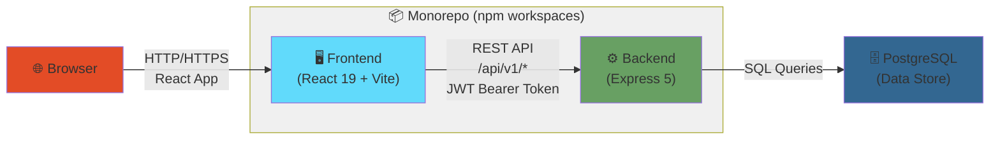
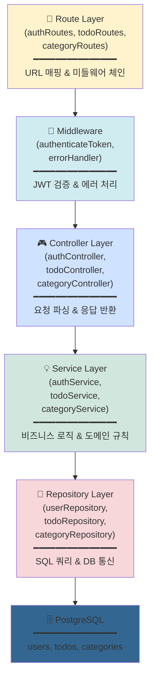
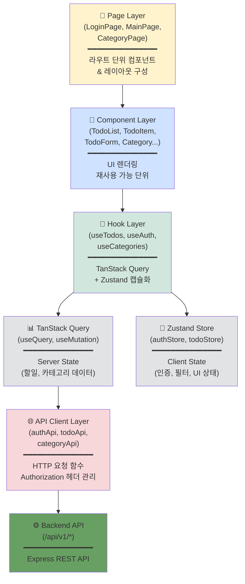
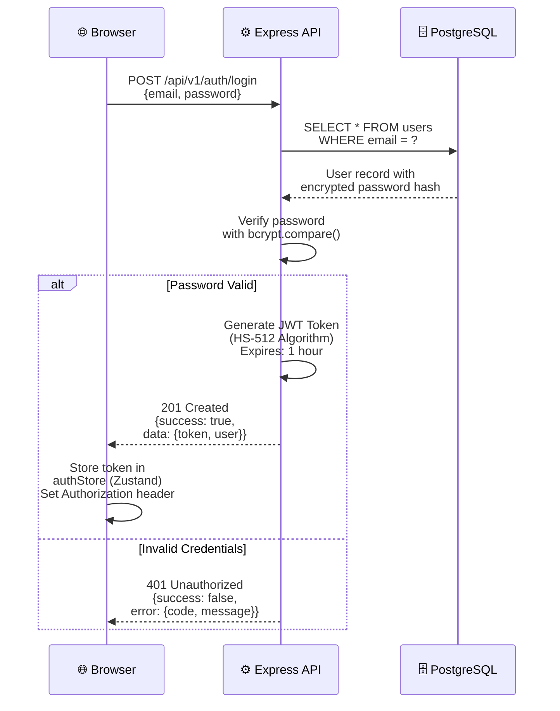

# TodoList 기술 아키텍처 다이어그램

**버전**: 1.0  
**작성일**: 2026-04-28  
**작성자**: Documentation Engineer / Claude

---

## 변경 이력

| 버전 | 날짜 | 작성자 | 변경 내용 |
|------|------|--------|-----------|
| 1.0 | 2026-04-28 | Documentation Engineer / Claude | 최초 작성 (4개 다이어그램 포함) |

---

## 1. 전체 시스템 개요

모노레포(npm workspaces) 기반 3-Tier 아키텍처로 구성된 TodoList 애플리케이션. 브라우저의 React 프론트엔드가 Express 백엔드의 REST API를 호출하고, 백엔드는 PostgreSQL 데이터베이스와 통신하며, JWT 인증으로 보호됩니다.



---

## 2. 백엔드 레이어 구조

Express 애플리케이션은 4개의 수직 레이어로 구성되며, 요청은 Route → Controller → Service → Repository → DB 순서로 처리됩니다. 각 레이어는 단일 책임을 가지며, 역방향 의존은 금지됩니다.



---

## 3. 프론트엔드 레이어 구조

React 애플리케이션은 Page → Component → Hook → API Client 구조로 설계되며, TanStack Query(서버 상태)와 Zustand(클라이언트 UI 상태)를 분리하여 관리합니다.



---

## 4. 인증 시퀀스 (로그인)

사용자가 로그인 요청을 하면 Express 백엔드에서 이메일을 기반으로 사용자를 조회하고, bcrypt로 비밀번호를 검증한 후 JWT 토큰을 발급합니다. 클라이언트는 이 토큰을 이후 모든 API 요청의 Authorization 헤더에 Bearer 토큰으로 포함시킵니다.



---

## 주요 기술 스택 매핑

| 계층 | 기술 스택 | 책임 |
|-----|---------|------|
| **클라이언트** | React 19, Vite, TanStack Query, Zustand | UI 렌더링, 서버/클라이언트 상태 관리 |
| **라우팅** | React Router | 페이지 네비게이션, 인증 가드 |
| **스타일링** | Tailwind CSS | 유틸리티 기반 반응형 CSS |
| **상태 관리** | TanStack Query + Zustand | 서버 상태(Query) / 클라이언트 상태(Zustand) 분리 |
| **백엔드 런타임** | Node.js 24, Express 5 | HTTP 서버, 라우팅, 미들웨어 처리 |
| **데이터베이스** | PostgreSQL, node-postgres(pg) | 관계형 데이터 저장소 |
| **인증** | JWT HS-512 | Bearer 토큰 기반 API 인증 |
| **패스워드** | bcrypt | 비밀번호 안전 저장 (cost: 12) |
| **빌드** | Vite | 번들링, HMR, 최적화 |
| **테스트** | Jest, Supertest | 단위/통합 테스트 |
| **린트** | ESLint | 코드 스타일 통일 |
| **모노레포** | npm workspaces | 패키지 분리 및 통합 관리 |

---

## 핵심 데이터 흐름

### 할일 조회 흐름
```
사용자 (MainPage.jsx)
  ↓
useTodos Hook (TanStack Query useQuery)
  ↓
todoApi.getTodos() (HTTP GET)
  ↓
Express Route: GET /api/v1/todos
  ↓
todoController.getTodos()
  ↓
todoService.getUserTodos() (비즈니스 로직)
  ↓
todoRepository.findByUserId() (SQL)
  ↓
PostgreSQL: SELECT * FROM todos WHERE user_id = ?
  ↓
응답: JSON 배열
  ↓
Query Cache (TanStack Query)
  ↓
화면 렌더링 (TodoList, TodoItem 컴포넌트)
```

### 할일 완료 처리 흐름
```
사용자 (TodoItem.jsx 클릭)
  ↓
handleComplete() 이벤트 핸들러
  ↓
useTodos Hook (TanStack Query useMutation)
  ↓
todoApi.completeTodo(id) (HTTP PATCH)
  ↓
Express Route: PATCH /api/v1/todos/:id/complete
  ↓
JWT 인증 미들웨어 (Bearer 토큰 검증)
  ↓
todoController.completeTodo()
  ↓
todoService.completeTodo() (소유권 검증, 상태 변경)
  ↓
todoRepository.updateCompletion() (SQL UPDATE)
  ↓
Query Cache 무효화 (onSuccess)
  ↓
화면 자동 갱신
```

---

## 보안 흐름

### JWT 인증 검증 프로세스

1. **요청 발송**: 클라이언트는 모든 API 요청 헤더에 `Authorization: Bearer <token>` 포함
2. **미들웨어 검증**: `authenticateToken` 미들웨어에서 JWT 서명 검증 및 만료 확인
3. **페이로드 추출**: 토큰이 유효하면 `req.user = { id, email }` 주입
4. **핸들러 실행**: Controller/Service에서 `req.user.id` 활용하여 소유권 검증 (BR-AUTH-03)
5. **접근 제어**: 타인 데이터 접근 시도 → 403 Forbidden 응답

### 데이터 접근 제어

```
서비스 계층에서:
  1. 요청받은 리소스 ID와 소유자(user_id) 일치 확인
  2. 일치하지 않으면 즉시 에러 반환 (403 Forbidden)
  3. 일치하면 비즈니스 로직 진행
```

---

## API 버전 관리 및 확장성

- **현재 버전**: `/api/v1/` (모든 엔드포인트)
- **향후 확장**: 하위 호환성 문제 발생 시 `/api/v2/` 추가 (v1은 최소 1개 버전 유지)
- **마이그레이션**: 클라이언트는 자동으로 최신 API 버전 사용

---

## 배포 및 운영 고려사항

| 요소 | 구성 |
|-----|------|
| **개발 환경** | localhost:5173 (Frontend) + localhost:3000 (Backend) |
| **CORS 설정** | 개발: `http://localhost:5173`, 프로덕션: 실제 도메인 |
| **환경변수** | `frontend/.env`, `backend/.env` (git 제외) |
| **DB 마이그레이션** | `db/migrations/` (순번 prefix로 순서 관리) |
| **로깅** | ERROR, WARN, INFO, DEBUG (프로덕션에서 DEBUG 비활성화) |
| **트랜잭션** | Service에서 조율, 필요 시 pg transaction 적용 |

---

## 상태 관리 구조 (Zustand + TanStack Query)

### 서버 상태 (TanStack Query)
- **캐시 대상**: 할일 목록, 카테고리 목록, 사용자 정보
- **무효화 트리거**: CREATE, UPDATE, DELETE 뮤테이션 후 `queryClient.invalidateQueries()`
- **동기화**: 서버와 클라이언트 데이터 일관성 자동 유지

### 클라이언트 상태 (Zustand)
- **UI 필터**: 선택된 카테고리, 정렬 기준, 검색 텍스트
- **인증 정보**: JWT 토큰, 사용자 정보, 로그인 여부
- **휘발성 상태**: 모달 열림/닫힘, 폼 입력 임시값

---

## 성능 최적화 전략

| 레이어 | 최적화 기법 |
|--------|-----------|
| **Frontend** | 코드 분할 (Vite), 조건부 로딩, 쿼리 캐싱, 가상 스크롤링 (대량 할일) |
| **Backend** | DB 인덱스 (user_id, created_at), 쿼리 최적화, 연결 풀링 |
| **DB** | FK 인덱싱, 쿼리 실행 계획 분석, 정기적 VACUUM |
| **네트워크** | Gzip 압축, API 응답 최소화, 배치 요청 지원 (향후) |

---

## 안내

더 자세한 정보는 다음 문서를 참고하세요:

- **도메인 정의**: [1-domain-definition.md](./1-domain-definition.md)
- **제품 요구사항**: [2-prd.md](./2-prd.md)
- **사용자 시나리오**: [3-user-scenario.md](./3-user-scenario.md)
- **구조 설계 원칙**: [4-architecture-principles.md](./4-architecture-principles.md)
