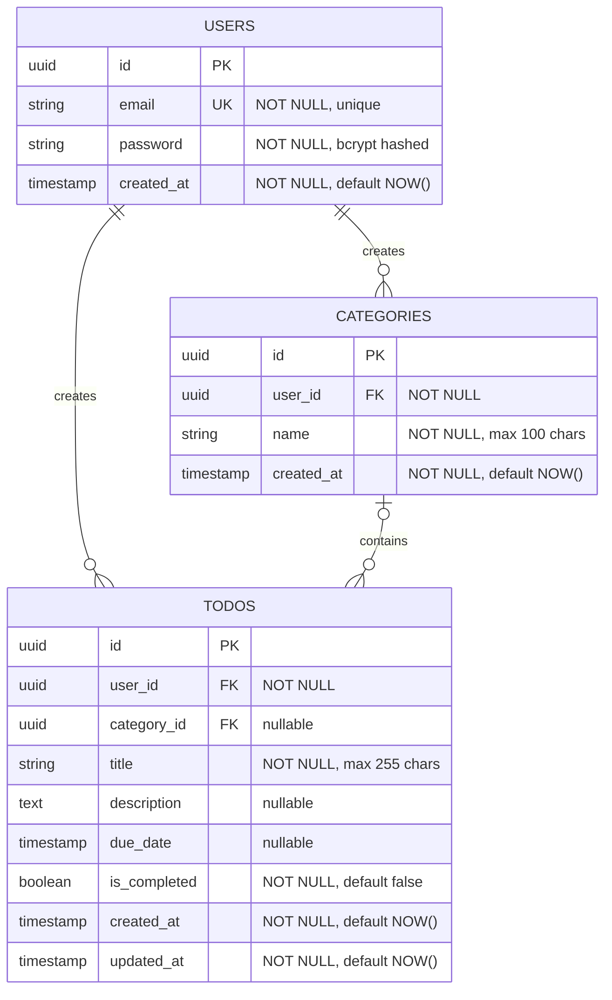

# TodoList ERD

**버전**: 1.0
**작성일**: 2026-04-28
**작성자**: Documentation Engineer / Claude

---

## 변경 이력

| 버전 | 날짜 | 작성자 | 변경 내용 |
|------|------|--------|-----------|
| 1.0 | 2026-04-28 | Documentation Engineer / Claude | 초기 ERD 문서 작성, 3개 엔티티 정의 및 관계 설정 |

---

## 1. ERD (Entity Relationship Diagram)

TodoList 애플리케이션의 데이터 모델은 **User**, **Category**, **Todo** 3개의 핵심 엔티티로 구성됩니다.
사용자는 여러 카테고리와 할일을 생성할 수 있으며, 할일은 선택적으로 카테고리에 속할 수 있습니다.

---

## 2. 테이블 정의

### 2.1 users

사용자 계정 정보를 저장하는 테이블입니다. 모든 인증 및 데이터는 사용자 ID를 기반으로 관리됩니다.

| 컬럼명 | 데이터 타입 | 제약사항 | 설명 |
|--------|-----------|--------|------|
| id | UUID | PRIMARY KEY | 사용자 고유 식별자 |
| email | VARCHAR(255) | UNIQUE, NOT NULL | 로그인 이메일 주소 (중복 불가) |
| password | VARCHAR(255) | NOT NULL | bcrypt 해시로 암호화된 비밀번호 |
| created_at | TIMESTAMP | NOT NULL, DEFAULT NOW() | 계정 생성 일시 |

**특성**:
- 이메일은 사용자의 유일한 식별 키입니다.
- 비밀번호는 평문으로 저장되지 않으며, bcrypt 해시로 암호화됩니다.
- 회원 탈퇴 시 하드 딜리트(Hard Delete) 대상입니다.

---

### 2.2 categories

사용자가 생성한 카테고리 정보를 저장하는 테이블입니다. 각 카테고리는 특정 사용자에게만 속합니다.

| 컬럼명 | 데이터 타입 | 제약사항 | 설명 |
|--------|-----------|--------|------|
| id | UUID | PRIMARY KEY | 카테고리 고유 식별자 |
| user_id | UUID | FOREIGN KEY → users.id, NOT NULL | 카테고리 소유자 (사용자 ID) |
| name | VARCHAR(100) | NOT NULL | 카테고리 이름 |
| created_at | TIMESTAMP | NOT NULL, DEFAULT NOW() | 카테고리 생성 일시 |

**특성**:
- 각 사용자는 독립적인 카테고리 목록을 소유합니다.
- 카테고리 이름은 최대 100자입니다.
- 카테고리 삭제 시 속한 할일의 category_id는 NULL로 설정됩니다 (SET NULL).

---

### 2.3 todos

사용자가 생성한 할일 정보를 저장하는 테이블입니다. 각 할일은 사용자에 속하며, 선택적으로 카테고리에 속할 수 있습니다.

| 컬럼명 | 데이터 타입 | 제약사항 | 설명 |
|--------|-----------|--------|------|
| id | UUID | PRIMARY KEY | 할일 고유 식별자 |
| user_id | UUID | FOREIGN KEY → users.id, NOT NULL | 할일 소유자 (사용자 ID) |
| category_id | UUID | FOREIGN KEY → categories.id, NULLABLE | 할일이 속한 카테고리 (미분류는 NULL) |
| title | VARCHAR(255) | NOT NULL | 할일 제목 |
| description | TEXT | NULLABLE | 할일 상세 설명 |
| due_date | TIMESTAMP | NULLABLE | 할일 완료 목표 일시 |
| is_completed | BOOLEAN | NOT NULL, DEFAULT false | 완료 여부 플래그 |
| created_at | TIMESTAMP | NOT NULL, DEFAULT NOW() | 할일 생성 일시 |
| updated_at | TIMESTAMP | NOT NULL, DEFAULT NOW() | 할일 최종 수정 일시 |

**특성**:
- 각 할일은 정확히 하나의 사용자에게 속합니다.
- 카테고리 할당은 선택 사항이며, 미분류 할일은 category_id가 NULL입니다.
- 종료일(due_date)도 선택 사항이며, NULL일 경우 기한 초과 판별 대상에서 제외됩니다.
- is_completed가 true인 할일은 기한 초과(overdue) 상태로 분류되지 않습니다.
- updated_at은 할일이 수정될 때마다 자동으로 업데이트됩니다.

---

## 3. 관계 및 제약사항

### 3.1 User → Category (1:N)

**관계**: 한 명의 사용자는 여러 개의 카테고리를 생성할 수 있습니다.

- **다중성**: 1 : N
- **외래키**: categories.user_id → users.id
- **제약**: NOT NULL (사용자 없이 카테고리가 존재할 수 없음)
- **삭제 전략**: CASCADE (사용자 삭제 시 해당 카테고리도 삭제)
- **비즈니스 규칙**: BR-AUTH-03 (사용자는 자신의 카테고리만 접근 가능)

---

### 3.2 User → Todo (1:N)

**관계**: 한 명의 사용자는 여러 개의 할일을 생성할 수 있습니다.

- **다중성**: 1 : N
- **외래키**: todos.user_id → users.id
- **제약**: NOT NULL (사용자 없이 할일이 존재할 수 없음)
- **삭제 전략**: CASCADE (사용자 삭제 시 해당 할일도 삭제)
- **비즈니스 규칙**: BR-AUTH-03 (사용자는 자신의 할일만 접근 가능), BR-DATA-05 (회원 탈퇴 시 즉시 삭제)

---

### 3.3 Category → Todo (1:N, Optional)

**관계**: 한 개의 카테고리는 여러 개의 할일을 포함할 수 있습니다. 반대로 할일은 카테고리 없이도 존재할 수 있습니다.

- **다중성**: 1 : N (Optional on Todo side)
- **외래키**: todos.category_id → categories.id
- **제약**: NULLABLE (할일이 카테고리 없이 존재 가능 — 미분류)
- **삭제 전략**: SET NULL (카테고리 삭제 시 속한 할일의 category_id를 NULL로 설정)
- **비즈니스 규칙**: BR-DATA-03, BR-DATA-04 (할일은 카테고리 없이도 존재 가능)

---

## 4. 인덱스 정의

성능 최적화를 위해 다음 인덱스를 정의합니다.

| 인덱스명 | 테이블 | 컬럼 | 유형 | 용도 |
|---------|--------|------|------|------|
| idx_categories_user_id | categories | user_id | BTREE | 사용자별 카테고리 목록 조회 성능 향상 |
| idx_todos_user_id | todos | user_id | BTREE | 사용자별 할일 목록 조회 성능 향상 |
| idx_todos_category_id | todos | category_id | BTREE | 카테고리별 할일 필터링 성능 향상 |
| idx_todos_due_date | todos | due_date | BTREE | 기한 임박(24시간 이내) 및 기한 초과 할일 조회 성능 향상 |

### 복합 인덱스 (권장)

추가로 다음과 같은 복합 인덱스를 고려할 수 있습니다:

| 인덱스명 | 테이블 | 컬럼 | 용도 |
|---------|--------|------|------|
| idx_todos_user_completed_due | todos | (user_id, is_completed, due_date) | 사용자별 미완료 할일을 기한 순서로 조회 |
| idx_todos_user_category | todos | (user_id, category_id) | 사용자 내 카테고리별 할일 조회 |

---

## 5. 데이터 무결성 및 보안

### 5.1 참조 무결성

- **CASCADE DELETE**: 사용자 삭제 시 그 사용자의 모든 카테고리와 할일이 자동 삭제됩니다.
- **SET NULL**: 카테고리 삭제 시 해당 카테고리에 속한 할일은 보존되며, category_id만 NULL로 설정됩니다.

### 5.2 데이터 보안

- **패스워드 암호화**: 모든 사용자 비밀번호는 bcrypt로 해시화하여 저장합니다.
- **소유권 검증**: 애플리케이션 레벨에서 user_id를 검증하여 다른 사용자의 데이터 접근을 차단합니다.
- **감시 필드**: created_at, updated_at은 자동으로 관리되어 데이터 변조를 추적할 수 있습니다.

---

## 6. 마이그레이션 고려사항

### 6.1 초기 구축 시

1. **users 테이블 생성** (이메일 유니크 인덱스 포함)
2. **categories 테이블 생성** (user_id 외래키, ON DELETE CASCADE)
3. **todos 테이블 생성** (user_id, category_id 외래키, 각 인덱스)

### 6.2 확장 시나리오

향후 다음과 같은 기능 확장 시 테이블 구조 검토가 필요합니다:

- **협업 기능**: Category/Todo 공유 권한 관리를 위한 테이블 추가
- **반복 할일**: 반복 일정을 관리하는 Recurrence 엔티티 추가
- **태그/라벨**: 다대다 관계의 Tags 엔티티 추가
- **할일 히스토리**: 변경 이력 추적을 위한 TodoHistory 테이블 추가

